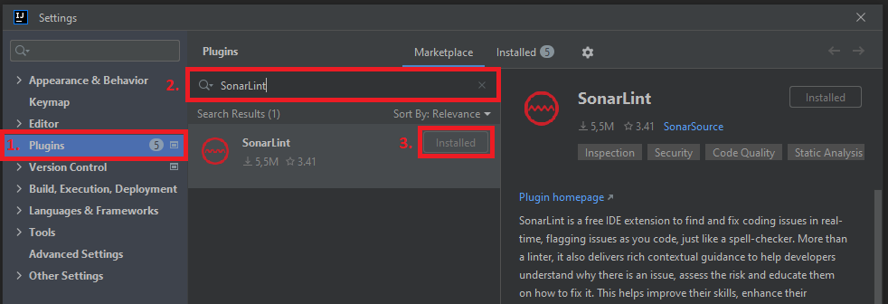
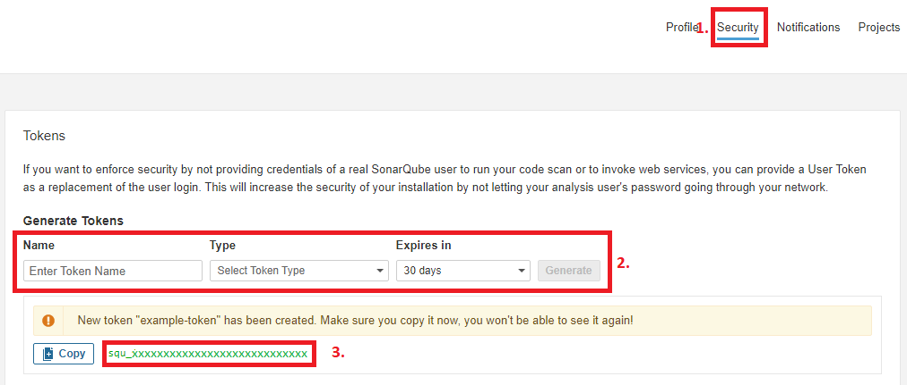
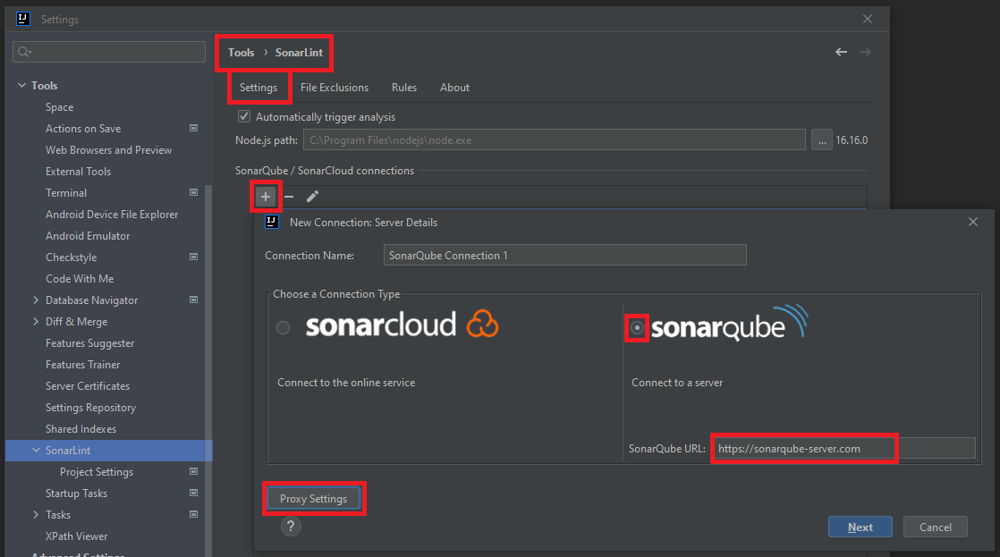
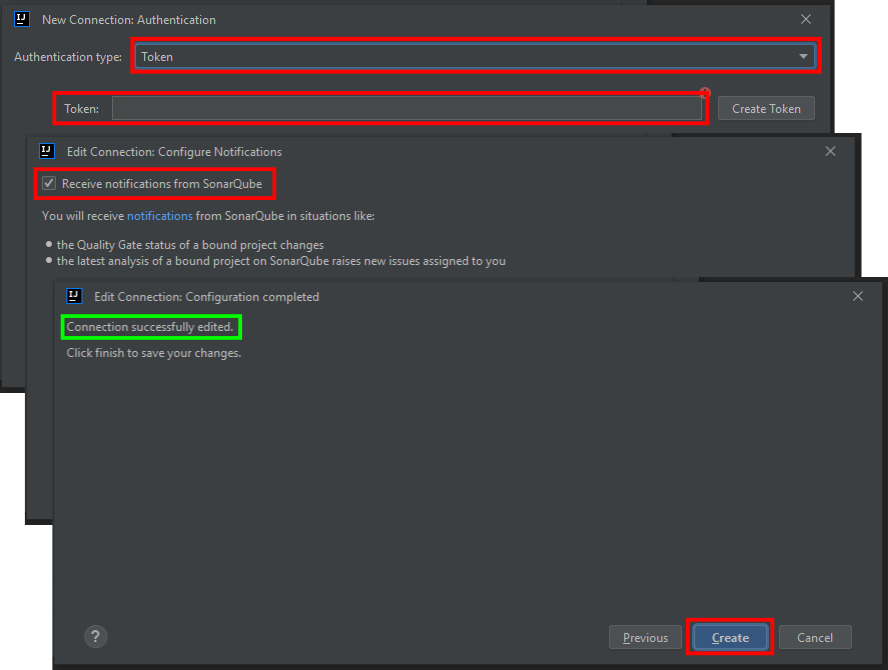
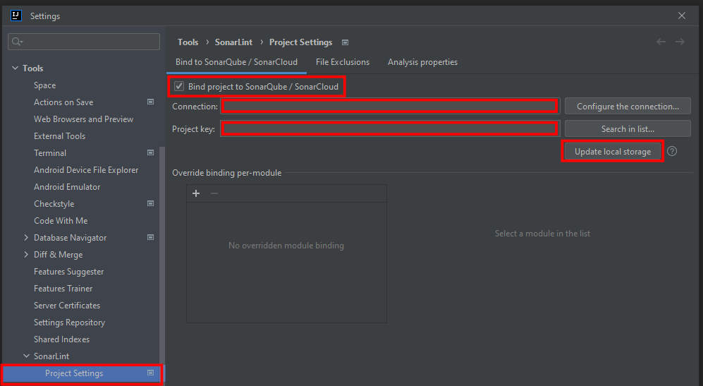

## Introduction

In this post, we are going to discuss the process of installing, configuring, and connecting SonarLint in IntelliJ IDE with the SonarQube server. Please note that this post does not cover the installation and configuration of SonarQube server.

### Brief explanation of SonarLint and SonarQube

***SonarLint*** is an IDE extension that helps developers identify and resolve quality issues while writing code. It analyzes code for a variety of issues such as bugs, vulnerabilities, code smells and provides suggestions to fix them. It allows developers to resolve code quality issues early on in the development process and reduce the cost of maintenance.

***SonarQube*** is an open-source tool which can be integrated with build tools, such as Jenkins, for continuous inspection and automatic static analysis of code quality to detect vulnerabilities, bugs and code smells in build process.

### Why it's important to bind them in IntelliJ IDE

Both SonarLint and SonarQube are technologies that perform code inspection and analysis to detect and resolve code quality issues. Nevertheless, they have different functionality scopes. SonarLint analyzes code while writing it in the IDE, providing instant feedback, while SonarQube is used in the build phase to continuously inspect and analyze the codebase.

It is recommended to use both SonarLint and SonarQube tools together, where the SonarLint plugin installed in the IDE is connected to the SonarQube server, especially if multiple developers are involved in the development process. In addition to the benefits mentioned earlier, such as improving code quality and reducing maintenance costs, integrating SonarLint with SonarQube in the IDE also ensures compliance with coding standards and best practices within the development team. Moreover, it facilitates collaboration by providing a common platform for developers to maintain, collaborate and share settings on server side such as quality profiles, analysis settings and quality gates. Additionally optional notifications from SonarQube keep team informed of any quality gate status change.

## Installing SonarLint plugin in IntelliJ IDE

- Go to the menu File → Settings → Plugins → Type “SonarLint” → Install and Restart IDE

After this step we can already use the SonarLint with default local rules. But we are going discuss how to bind SonarLint to SonarQube server in the next chapter.

## Setting up SonarQube server

In this step we are going to generate a SonarQube authentication token for SonarLint plugin in IntelliJ IDE 

- Go to SonarQube → Open your Account/Profile Page → select Security tab
- Enter or select Name, Type (e.g. User token) and duration of the Expiry
- Generate and Copy authentication token

## Binding SonarLint with SonarQube

### Add new SonarQube Connection

- In IntelliJ go to the menu File → Settings → Tools → SonarLint
- Select Settings tab → click on “+” sign to create new SonarQube connection
- In opened window give a Connection Name, Choose a Connection Type (e.g. SonarQube) and enter SonarQube URL
- Enable or disable proxy as you need and click Next

- In opened window select Authentication type (e.g. Token) and paste your SonarQube authentication token from previous chapter in field Token and click Next
- In the next step check “Receive notification from SonarQube” if you wish to receive notification about Quality Gate status and click Next
- If everything was correct, you will see "Connection successfully created" in the next window and click Finish to save connection settings.

So far we have managed to create a SonarQube connection in SonarLint plugin settings and successfully connect to SonarQube server.

### Configure SonarLint Project Settings

In this step we are going to add SonarQube Connection created in previous step and select specific SonarQube project, since SonarQube may have many projects.

- In IntelliJ go to the menu File → Settings → Tools → SonarLint → Project Settings
- Select “Bind project to SonarQube”
- Select newly create SonarQube Connection in field Connection
- Search and select your project using “Search in list…” button (hint: to fetch project list from SonarQube server may take several seconds)
- Finally click “Update local storage” to download the settings and rules from SonarQube server
- You can track the progress of the update process in IntelliJ/SonarLint logs

Congratulations, you have successfully bound the SonarLint plugin in IntelliJ IDE to the SonarQube server. You can now use the SonarLint plugin with SonarQube in IntelliJ IDE by e.g. simply opening a Java class and selecting "Analyze with SonarLint" from the context menu of editor.

## Conclusion

In this article, we learned how to install, configure and connect SonarLint plugin in IntelliJ IDE with the SonarQube server. By using SonarLint and SonarQube tools together developers can take the benefits of both to perform code inspection and analysis to detect and resolve code quality issues and reduce maintenance costs.

## References

1. [Wikipedia]([https://www.wikipedia.org/](https://www.wikipedia.org/))
2. [SonarSource Community]([https://community.sonarsource.com/](https://community.sonarsource.com/))