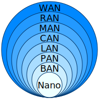

## Intro

This document contains my notes on Networking Fundamentals, which I studied in preparation for the Cisco Certified Network Associate (CCNA) certification.

## Tools

[Cisco Packet Tracer](https://skillsforall.com/course/getting-started-cisco-packet-tracer), an innovative network configuration simulation tool.

## Basic networking terms

### Computer network

A **computer network** is a group of two or more computers that are linked together used to share resources, to exchange files, or to communicate with others.

### MAC address

A **MAC address** (short for medium access control address) is a unique identifier assigned to a network interface controller (NIC) for use as a network address in communications within a network segment.  
**MAC address formats**: XX:XX:XX:XX:XX:XX, XX-XX-XX-XX-XX-XX or XXXXXXXXXXXX - 6 groups of 2 hexadecimal digits (12-digit: 6 bytes or 48 bits).

### LAN

A **local area network** (LAN) is a computer network that interconnects computers within a limited area such as a residence, school, laboratory, university campus or office building.

### WAN

A **wide area network** (WAN) is a telecommunications network that extends over a large geographic area.

### DHCP

The Dynamic Host Configuration Protocol (**DHCP**) is a network management protocol used on Internet Protocol (**IP**) networks for automatically assigning IP addresses and other communication parameters to devices connected to the network using a client–server architecture

### Firewall

A **firewall** is a network security system that monitors and controls incoming and outgoing network traffic based on predetermined security rules. A firewall typically establishes a barrier between a trusted network and an untrusted network, such as the Internet.  
Firewalls are categorized as a

- **Network-based** firewalls are positioned between two or more networks, typically between the local area network (LAN) and wide area network (WAN), their basic function being to control the flow of data between connected networks. They are either a software appliance running on general-purpose hardware, a hardware appliance running on special-purpose hardware, or a virtual appliance running on a virtual host controlled by a hypervisor.
- **Host-based** firewalls are deployed directly on the host itself to control network traffic or other computing resources. This can be a daemon or service as a part of the operating system or an agent application for protection.

### IDS & IPS

**Intrusion detection systems** (IDS) and **intrusion prevention systems** (IPS) are device or software application that continually monitor a network or systems, detect and log potential incidents, take action to stop the incidents, and notify/warn security administrators.

## Network devices

### Repeater

A **Repeater** (also called a hub) is an electronic device that receives a signal and retransmits it. Repeaters are used to extend transmissions so that the signal can cover longer distances or be received on the other side of an obstruction.  
Some types of repeaters broadcast an identical signal, but alter its method of transmission, for example, on another frequency or baud rate (speed of communication).  
Repeaters operate on the _physical layer_, the first layer of the _OSI model_;

### Network bridge

A **network bridge** is a computer networking device that creates a single, aggregate network from multiple communication networks or network segments.

### Network switch

A **network switch** (also called **switching hub**, **bridging hub**, and, by the IEEE, **MAC bridge**) is networking hardware that connects devices on a computer network by using packet switching to receive and forward data to the destination device.  
A network switch is a multiport network bridge that uses MAC addresses to forward data at the _data link layer_ (layer 2) of the _OSI model_. Some switches can also forward data at the _network layer_ (layer 3) by additionally incorporating routing functionality. Such switches are commonly known as _layer-3 switches_ or _multilayer switches_. In contrast to repeater, network switches has intelligence.  
Network switches mainly operate on the _data link layer_, the second layer of the _OSI model_ and used in LAN.

### Router

A **router** is a networking device that forwards data packets between computer networks using IP addresses.  
Routers operate on the _network layer_, the third layer of the _OSI model_ ;

### Wireless Access Point

A **wireless access point**, or just **access point** (AP), is a networking hardware device that allows other Wi-Fi devices to connect to a wired network or wireless network.  
As a standalone device, the AP may have a wired connection to a _switch_ or _router_, but, in a _wireless router_, it can also be an integral component of the router itself.

### Wireless LAN Controller

A **wireless LAN controller** (WLC) is a network device used to monitor and manage wireless access points in an organization. WLCs are connected to routers and allow devices from across the organization to connect to the router via access points.

### Lightweight Access Point

A **Lightweight Access Point** (LWAP) is a type of wireless access point (AP) which is managed, configured and controlled by wireless LAN controller (WLC). Unlike LWAP, autonomous access points operates independently and does not need WLC.

## Computer network types by scale

- Nanoscale
- Near-field (NFC)
- Body
- Personal (PAN)
- Near-me
- Local (LAN)
  - Storage (SAN)
  - Wireless (WLAN)
  - Virtual (VLAN)
  - Home (HAN)
- Building
- Campus (CAN)
- Backbone
- Metropolitan (MAN)
  - Municipal wireless (MWN)
- Wide (WAN)
- Cloud
- Internet
- Interplanetary Internet

## References

- [Wikipedia](https://www.wikipedia.org/)
- [The Complete Networking Fundamentals Course. Your CCNA start](https://www.udemy.com/share/101WrE/)
