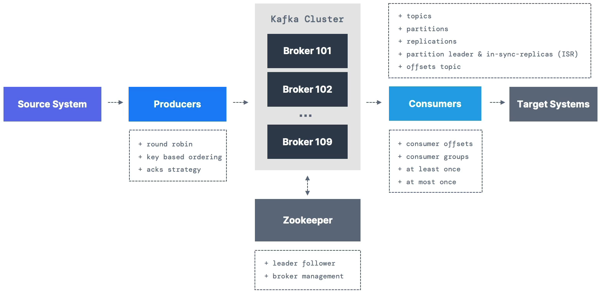

---
title: Apache Kafka
---

## Introduction

This document contains my notes on Apache Kafka, which I studied from Udemy Course "Apache Kafka Series - Learn Apache Kafka for Beginners v3" by Stephane Maarek

### Why Apache Kafka

- Decoupling of data streams and systems
  - N Source Systems ---> Kafka ---> N Target Systems
- Distributed, resilient architecture, fault tolerant
- Horizontal scalability:
  - Can scale to 100s of brokes
  - Can scale to millions of messages per second
- High performance (latency of less than 10ms) - real life

### Apache Kafka Use Cases

- Messaging System
- Activity Tracking
- Gather metrics from many different locations
- Application Logs gathering
- Stream processing (with the Kafka Streams API for example)
- De-coupling of system dependencies
- Integration with Spark, Flink, Storm, Hadoop and many other Big Data Technologies
- Micro-services pub/sub 

Real use cases examples:

- **Netflix** - uses Kafka to apply recommendations in real-time while you're watching TV shows
- **Uber** - uses Kafka to gather user, taxi and trip data in real-time to compute and forecast demand, and compute surge pricing in real-time
- **LinkedIn** - uses Kafka to prevent spam, collect user interactions to make better connection recommendations in real time.

> [!NOTE]
> Kafka is only used as a transportation mechanism!

### [Course Material Download](https://www.conduktor.io/apache-kafka-for-beginners)

## Kafka Theory

### Topics

- Topics: a particular streams of data
- Like a table in database (without all the constrains)
- One can have as many topics as one want
- A topic is identified by its *name*
- Topics support any kind of message format (e.g. json, txt, binary etc.)
- The sequence of message is called a *data stream*
- One can not query topics, instead, use Kafka **Producers** to send data and Kafka **Consumers** to read the data
- Kafka topics are **immutable**
- Data is kept only for a limited time (*default* is one week, but configurable)

### Partitions and Offsets

- Topics are split in **partitions** (e.g. 100 partitions)
  - Messages within each partition are ordered
  - Each message within a partition gets an incremental ID, called **offset**
- Kafka topics are **immutable**: once data is written to a partition, it can not be changed
- Offset only have a meaning for a specific partition
  - E.g. offset 3 in partition 0 doesn't represent the same data as offset 3 in partition 1
  - Offsets are not re-used even if previous message have been deleted
- Order is guaranteed only within a partition (not across partitions)
- Data is assigned randomly to a partition unless a key is provided
- One can have as many partitions per topic as one want

### Producers

- Producers write date to topics (which are made of partitions)
- Producers know in advance to which partition to write to (and which Kafka broker has it)
- In case of Kafka failure, Producers will automatically recover

#### **Producer's Message Key**

- Producers can choose to send a **key** with the messsage (string, number, binary, etc.)
- if `key=null`, data is sent round robin (partition 0, then 1, then 2..)
- if `key!=null`, then all messages for that key will always go to the same partition (hashing)
- A key are typically sent if you need message ordering for a specific field (ex: truck_id)

#### Kafka Messages Anatomy

- Key-binary
  - can be null
- Value-binary
  - can be null
- Compression Type
  - none
  - gzip
  - snappy
  - lz4
  - zstd
- Headers (optional)
  - key/value
  - key/value
- Partition+Offset
- Timestamp (system or user set)

#### Kafka Message Serializer

- Kafka only accepts bytes as an input from producers and sends bytes out as an output to consumers
- Message Serialization means transforming objects/data into bytes
- Serializers are used on the value and the key
- Kafka comes with **Common Serializers**
  - String (incl. JSON)
  - Int, Float 
  - Avro
  - Protobuf

#### Kafka Message Key Hashing

- A Kafka partitioner is a code logic that takes a record and determines to which partition to send it into
- **Key Hashing** is the process of determining the mapping of a key to a partition
- In the defualt Kafka partitioner, the keys are hashed using the **marmur2 algorithm** with the formula below:

`targetPartition = Math.abs(Utils.marmur2(keyBytes)) % (numPartitions - 1)`

### Consumers

- Consumers read data from a topic (identified by name) - pull model
- Consumers automatically know which broker to read from
- In case of broker failures, consumers know how to recover
- Data is read in order from low to high offset **within each partitions**

#### Consumer Deserializers

- **Deserialize** indicates how to transform bytes into objects/data
- Deserializers are used on the value and the key of the message
- Kafka **Common Deserializers**
  - String (incl. JSON)
  - Int, Float
  - Avro
  - Protobuf

> !NOTE
> The serialization/deserialization type must not change during a topic lifecycle

#### Consumer Groups

- All the consumers in an application read data as a consumer groups
- To create distinct consumer groups, use consumer property `group.id`
- Each consumer within a group reads from exclusive partitions
- If one have more consumers than partitions, some consumers will be inactive
- **Multiple Consumers on one topic**
  - In Apache Kafka it is acceptable to have multiple consumer groups on the same topic
  - E.g. 1 consumer service for location, 1 consumer service for notification in track example

#### Consumer Offsets

- Kafka stores the offsets at which a consumer group has been reading
- The offsets committed are in Kafka topics named `__consumer_offsets`
- When a consumer in a group has processed data reveived from Kafka, it should be **periodically** committing the offsets (the Kafka broker will write to `__consumer_offsets`, not to the group itself)

#### Delivery semantics for consumers 

- By default, Java Consumers will automatically commit offsets (at least once)
- There are 3 delivery semantics if you choose to commit manually:
  - **At least once (usually preferred)**
    - Offsets are committed after the message is processed
    - If the processing goes wrong, the message will be read again
    - If message is read again, it can result in duplicate processing of messages. Make sure your processing is *idempotent* (i.e. processing again the messages will not impact your systems)
  - **At most once**
    - Offsets are committed as soon as messages are received
    - If the processing goes wrong, some messages will be lost (i.e. they will not be read again)
  - **Exactly once**
    - for Kafka -> Kafka workflows: use the Transactional API (easy with Kafka Streams API)
    - for Kafka -> External System workflow: use an idempotent consumer

## What is Next?

1. **Kafka for Beginners:** Kafka basics operations, producers and consumers
2. **Kafka Connect API:** Import/Export data to/from Kafka
3. **Kafka Streams API:** Process and Transform data within Kafka
4. **ksqlDB:** Write Kafka Streams applications using SQL
5. **Confluent Components:** REST Proxy and Schema Registry
6. **Kafka Security:** Setup Kafka security in a Cluster and Integrate your applications with Kafka Security
7. **Kafka Monitoring and Operations:** use Prometheus and Grafana to monitor Kafka, learn operations
8. **Kafka Cluster Setup and Administration:** Get a deep understanding of how Kafka and Zookeeper works, how to setup Kafka and various administration tasks
10. **Confluent Certifications**

## References

- [Apache Kafka for Beginners v3](https://www.udemy.com/course/apache-kafka)
